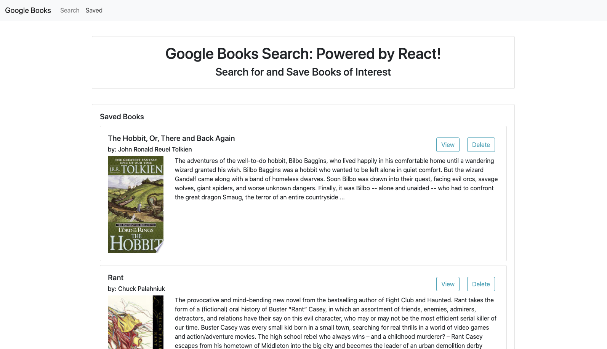
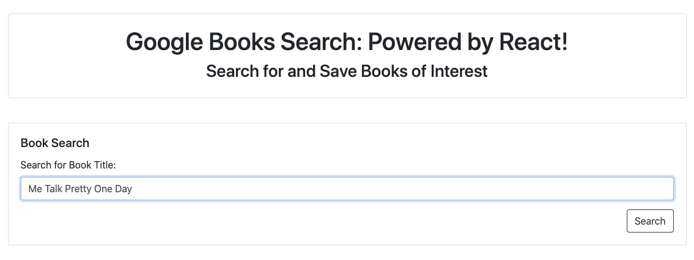
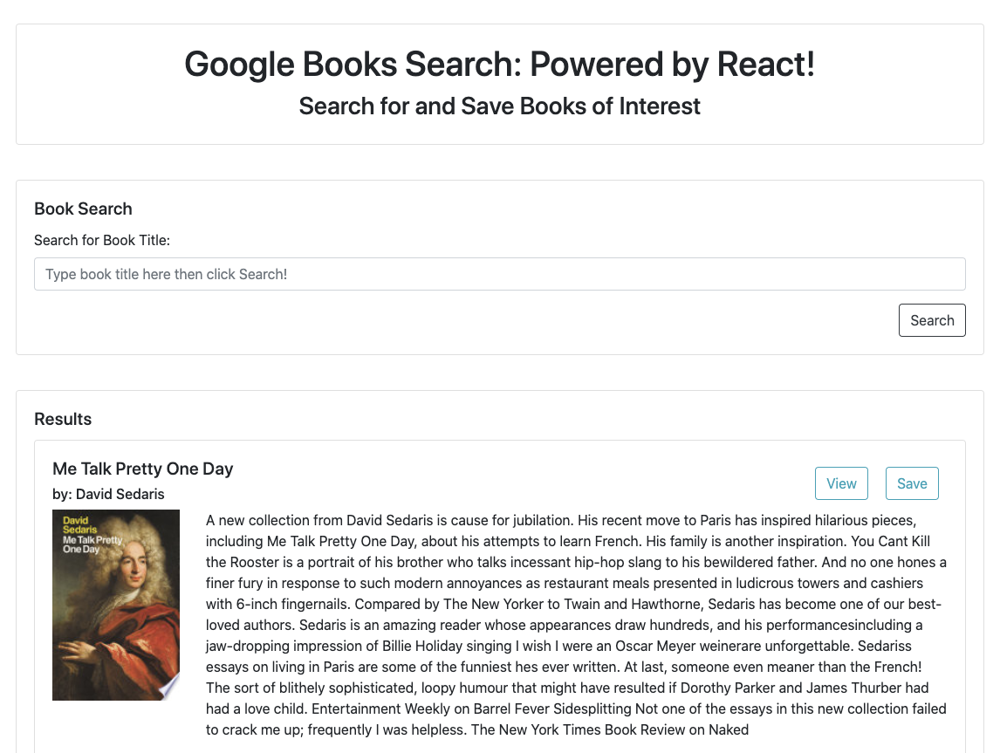

# google-books_hw21

[Deployed Google Books App!](https://google-books-hw21.herokuapp.com/)

## Description

This application lets the user search for books in the google database and save them to a book list where they can view them later or delete them from the list.

## User Story

* As a user, I want to be able to create a reading list that I can view and update.

## Usage

When the user navigates to this page, they can search for a book by title or author.

After searching, they will see the top 10 search results.  Every result will give them a chance to "view" which will take them to the google books page with more information about that specific book, or "save" which will save the book to their saved page for later viewing.

When viewing the saved list the user can again "View" a book, or "Delete" the book which removed it from their viewing list.

## Contributions

When contributing to this repository, please contact the owner of the repository before pushing any updates.
When contributions are accepted, please update the readme.md noting any changes that have been made.

## Authors and Acknowledgment

All files for this project were adapted and written by Raleigh Chesney based on files provided by GA Tech Coding Boot Camp.

Web Dev Tools:
* [Mozille Developer Network](https://developer.mozilla.org/en-US/)
* [Stack Overflow](https://stackoverflow.com/)
* [w3schools!](https://www.w3schools.com/bootstrap4/default.asp)

Thank you to all of my GT Bootcamp classmates who have offered advice and helped fix bugs alone the way.

## License

MIT License

Copyright (c) 2020 Raleigh Chesney

Permission is hereby granted, free of charge, to any person obtaining a copy
of this software and associated documentation files (the "Software"), to deal
in the Software without restriction, including without limitation the rights
to use, copy, modify, merge, publish, distribute, sublicense, and/or sell
copies of the Software, and to permit persons to whom the Software is
furnished to do so, subject to the following conditions:

The above copyright notice and this permission notice shall be included in all
copies or substantial portions of the Software.

THE SOFTWARE IS PROVIDED "AS IS", WITHOUT WARRANTY OF ANY KIND, EXPRESS OR
IMPLIED, INCLUDING BUT NOT LIMITED TO THE WARRANTIES OF MERCHANTABILITY,
FITNESS FOR A PARTICULAR PURPOSE AND NONINFRINGEMENT. IN NO EVENT SHALL THE
AUTHORS OR COPYRIGHT HOLDERS BE LIABLE FOR ANY CLAIM, DAMAGES OR OTHER
LIABILITY, WHETHER IN AN ACTION OF CONTRACT, TORT OR OTHERWISE, ARISING FROM,
OUT OF OR IN CONNECTION WITH THE SOFTWARE OR THE USE OR OTHER DEALINGS IN THE
SOFTWARE.